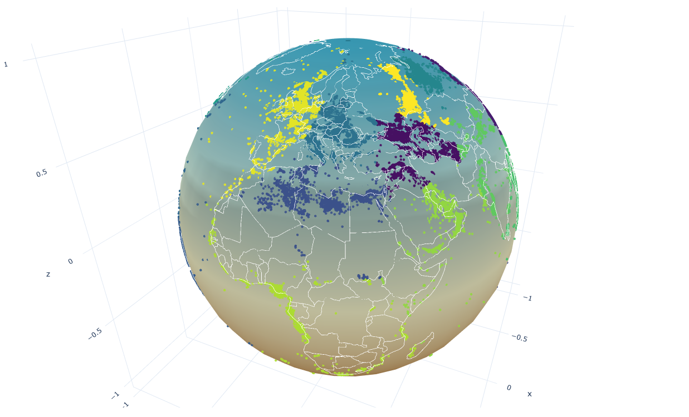

# Data Science Project

## `Global Oil Wells: A Machine Learning and Network Theoretic Analysis of Geolocation and Oil Well Characteristics`.

    

This project is a comprehensive exploration of regression models applied to well depth prediction using geospatial data. The models are designed to predict True Vertical Depth (TVD) based on latitude and longitude features. The project includes data preprocessing, model training, testing, and validation, as well as performance evaluation and visualization.

## Models

The project implements and evaluates the following regression models:

1. **k-NNR (k-Nearest Neighbors Regression)**  
   A regression model that predicts TVD based on the k-nearest neighbors of a given data point. The model supports distance-based weighting for predictions.

2. **k-MCR (k-Means Clustering Regression)**  
   A hybrid model that combines k-means clustering with regression. It clusters the data into groups and performs regression within each cluster.

3. **DTR (Decision Tree Regression)**  
   A decision tree-based regression model that splits the data into regions based on feature thresholds. The model supports various splitting criteria, such as mean squared error and absolute error.

4. **NTR (Network Theoretic Regression)**  
   A graph-based regression model that constructs a similarity graph using geospatial features. The model leverages network centrality measures and Laplacian regularization for predictions.

## Features

- **Data Preprocessing**: Handles missing data, filters invalid entries, and splits the dataset into training and testing subsets.
- **Model Testing Framework**: A robust framework for training, testing, and validating models with various hyperparameters.
- **Visualization**: Includes 3D plots and heatmaps to visualize model predictions and performance.
- **Performance Metrics**: Evaluates models using metrics such as Mean Absolute Error (MAE), Mean Squared Error (MSE), and R² score.

## Usage

1. **Data Preparation**: Place the well data CSV file in the `data/` folder.
2. **Model Training and Testing**: Use the `ModelTestFramework` to train and test models. Example scripts are provided in the `src/testing/test/` directory.
3. **Validation**: Perform parameter validation using scripts in the `src/testing/validation/` directory.
4. **Visualization**: Generate plots to analyze model performance and predictions.

## Author

**Ben Hunt**  
[GitHub Profile](https://github.com/benhunt19)  
[LinkedIn](https://www.linkedin.com/in/benjaminrjhunt)

If you have any questions, feedback, or suggestions, feel free to reach out or open an issue in the repository.